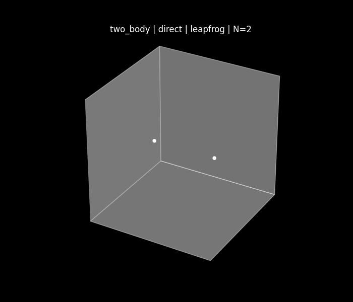
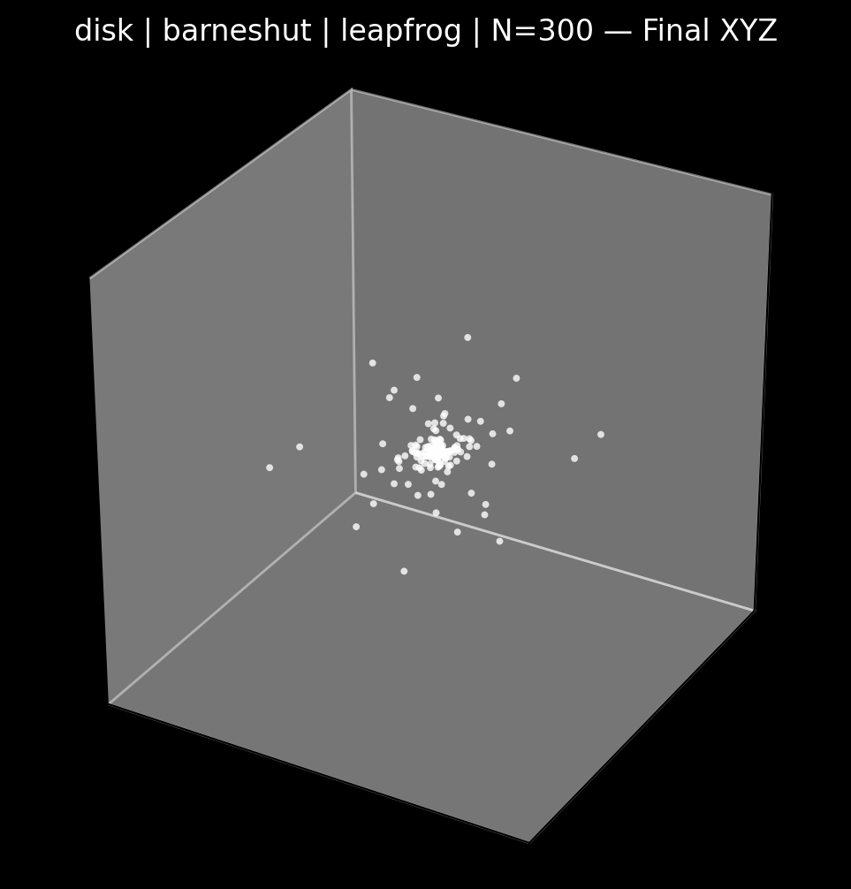
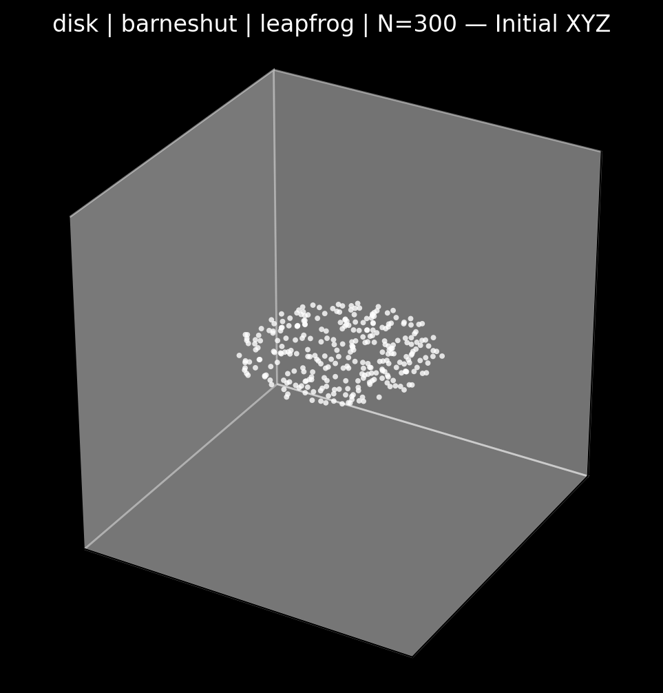
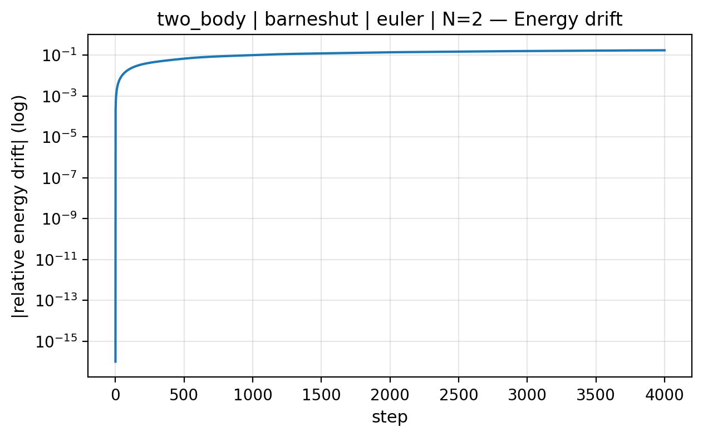
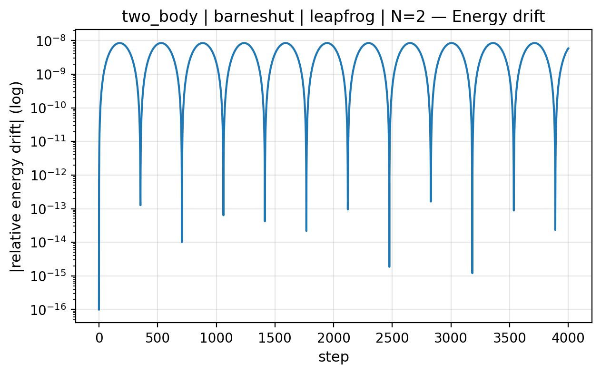

<p align="center">
  
</p>

<h1 align="center">The N-Body Problem</h1>

<p align="center">
  Modular gravitational N-body simulation engine in Python.<br>
  Direct & Barnes–Hut solvers • 3D support • Symplectic integration • Profiling & scaling analysis • Visualization pipeline
</p>

---

# Modular N-Body Simulation Engine (Python)

A structured portfolio project focused on building a modular,
physics-based N-body simulation engine with emphasis on:

- Clean software architecture  
- Numerical integration of Hamiltonian systems  
- Solver design and interchangeability  
- Scientific validation using conservation laws  
- Performance profiling and empirical scaling analysis  

---

## Architecture Overview

The codebase follows strict separation of concerns:

- **Bodies** store physical state only  
- **Physics** is implemented as pure, stateless functions  
- **Solvers** compute accelerations (Direct, Barnes–Hut)  
- **Integrators** advance the system in time (Euler, Leapfrog)  
- **Engine** orchestrates simulation and diagnostics  
- **Visualization layer** handles plotting and animation  

This design allows solvers and integrators to be swapped
without modifying diagnostics or physics code.

---

## Implemented Features

- Modular architecture with interchangeable components  
- Euler and Leapfrog (Velocity Verlet) integrators  
- Full 3D simulation support  
- Barnes–Hut octree solver (O(N log N))  
- Direct solver (O(N²))  
- Energy, momentum, and angular momentum diagnostics  
- CLI-based runner with configurable parameters  
- 2D and 3D animation with GIF / MP4 export  
- Reproducible predefined simulation scenes  

The project evolved through structured development phases,
culminating in a modular and experimentally validated simulation engine.

---

## Example Simulations

Below are outputs generated directly from the CLI interface.

### Two-Body Orbit (Leapfrog, Direct Solver)



---

### Rotating Disk (Barnes–Hut)





---

### Three-Body Figure-Eight (3D Animation)


---

### Energy Drift Comparison (Leapfrog vs Euler)





---

## Running the Simulation

Basic 2D orbit:

```bash
python -m code.nbody.cli run --scene two_body --animate
```

Basic 3D orbit:

```bash
python -m code.nbody.cli run --scene two_body --animate-3d
```

### CLI Help

To see all available options:

```bash
python -m code.nbody.cli --help
```

To see run command options:

```bash
python -m code.nbody.cli run --help
```

The help menu lists available scenes, solvers, integrators,
diagnostics flags, and export options.

---

## Benchmarking Direct vs Barnes–Hut

The `benchmark_cluster` scene is designed to demonstrate
the performance difference between:

- Direct O(N²) solver  
- Barnes–Hut O(N log N) solver  

To benchmark fairly:
- Disable animation  
- Disable plotting  
- Use identical scene and integrator settings  

### Windows (PowerShell)

Measure Barnes–Hut:

```powershell
Measure-Command { python -m code.nbody.cli run --scene benchmark_cluster --solver barneshut --integrator leapfrog }
```

Measure Direct:

```powershell
Measure-Command { python -m code.nbody.cli run --scene benchmark_cluster --solver direct --integrator leapfrog }
```

### macOS / Linux (bash / zsh)

Measure Barnes–Hut:

```bash
time python -m code.nbody.cli run --scene benchmark_cluster --solver barneshut --integrator leapfrog
```

Measure Direct:

```bash
time python -m code.nbody.cli run --scene benchmark_cluster --solver direct --integrator leapfrog
```

---

## Runtime Measurements

All measurements obtained with:

- **CPU:** Intel® Core™ i7-10750H @ 2.60GHz  
- **Python:** 3.11.9  
- Pure Python implementation  
- Animation and plotting disabled  
- Format: **mm:ss.mmm**

| Scene           | Solver        | Runtime    |
|----------------|--------------|-----------|
| two_body       | Direct        | 00:05.708 |
| disk           | Direct        | 04:09.332 |
| disk           | Barnes–Hut    | 05:55.300 |
| random_cluster | Direct        | 09:31.170 |
| random_cluster | Barnes–Hut    | 06:45.461 |

### Interpretation

- Direct solver exhibits quadratic growth as N increases.
- Barnes–Hut shows improved performance for larger systems.
- Tree construction overhead affects smaller and moderate systems.
- Observed behavior aligns with theoretical **O(N²)** vs **O(N log N)** complexity.

---

## Documentation

Detailed technical documentation is available in the `docs/` directory:

- `overview.md` – Project goals and scope  
- `architecture.md` – System design and modular structure  
- `phases.md` – Development progression  
- `performance.md` – Scaling and profiling analysis  
- `experiments.md` – Experimental observations  
- `notes.md` – Mathematical and implementation details  

---

## Scope & Limitations

- Newtonian gravity only  
- Fixed timestep (no adaptive stepping)  
- Pure Python implementation  
- No GPU acceleration  

The focus of this project is architectural clarity,
numerical behavior, and algorithmic analysis rather than raw performance.

---

## Summary

This project demonstrates:

- Modular scientific software design  
- Numerical integration of Hamiltonian systems  
- Symplectic stability vs non-symplectic drift  
- Octree-based spatial approximation  
- Empirical validation of algorithmic complexity  
- Profiling-driven optimization  

It serves as both a physics simulation engine
and a controlled experimental platform for studying
numerical stability and performance scaling.